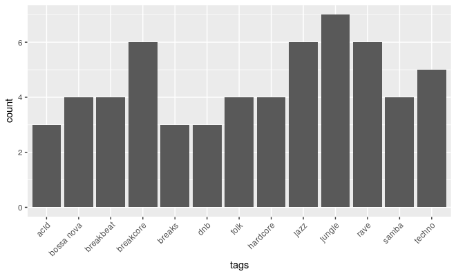

# bandcampr 

bandcampr is an R package for scraping data from bandcamp.com.

Bandcamp has stopped providing keys for their developer API. In order to get info on albums, fan collections, etc. we instead have to scrape it from their website.

## Installation

Install the latest development version of bandcampr using devtools:

```r
remotes::install_github("SimonLarsen/bandcampr")
```

## Example usage

```r
library(bandcampr)
library(ggplot2)

# Get collection for user SimonLarsen
collection <- get_fan_collection("SimonLarsen")
album_urls <- lapply(collection, "[[", "item_url")

# Get info for 20 most recent purchases
album_infos <- lapply(head(album_urls, 20), get_album_info)

# Get non-location (capitalized) tags occuring more than once
tags <- unlist(lapply(album_infos, "[[", "keywords"))
repeated_tags <- names(which(table(tags) > 2))
tags <- tags[tags %in% repeated_tags & !grepl("[A-Z]", tags)]

# Plot counts as bar plot
ggplot(mapping=aes(tags)) +
  geom_bar() +
  theme(axis.text.x=element_text(angle=45, hjust=1))
```

